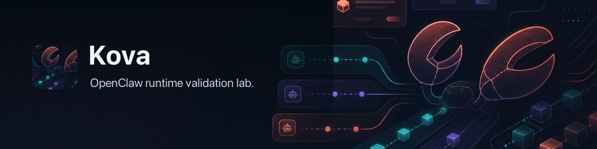

# Kova



**The OpenClaw runtime validation lab.**

Kova proves OpenClaw works end-to-end on real machines: install, upgrade,
gateway, sessions, plugins, agent turns, providers, dashboards, TUIs, MCP,
browsers, soak — with **real execution evidence**, not synthetic confidence.

> Can real users install, update, start, message, use plugins, and keep
> running without OpenClaw getting slow, unhealthy, leaky, or broken?

<p align="center">
  
</p>

## What Kova Proves

| | |
|---|---|
| 🚀 **Install & upgrade** | Fresh installs, release-track upgrades, version-to-version, durable-env clone → local-build, migrations. |
| 🧩 **Every runtime path** | Gateway, sessions, plugins, agent (CLI + Gateway), dashboard, TUI, MCP, browser, OpenAI-compatible, soak. |
| 💥 **Failure containment** | Timeouts, malformed providers, streaming stalls, network offline, missing auth, concurrent load, recovery. |
| ⏱ **Honest agent latency** | Pre-provider · provider · post-provider, split per turn with timeline span evidence. |
| 🧠 **Process attribution** | CPU and RSS across 21 named roles — never just "memory was high". |
| 📈 **Baselines & regressions** | `--repeat N` with median / p95 / max / variance. Per-platform baselines. Gate refuses to ship without proof. |
| 🔍 **Inventory audit** | Discovers OpenClaw CLI, scripts, plugins, entrypoints, and repeated Kova run work. |
| 🛰 **Diagnostics contract** | Timeline spans, event-loop delay, CPU/heap profiles on `--deep-profile`. |
| 🤖 **Agent-first I/O** | `kova.report.v1` JSON, summary, bundle, paste, compare. Verdict-led dashboard by default. |

```text
42 scenarios   ·   29 surfaces   ·   26 states   ·   8 profiles
21 process roles   ·   15+ collectors
```

## Quickstart

```sh
npm install
node bin/kova.mjs setup
node bin/kova.mjs self-check
```

Run a release gate against a local OpenClaw build:

```sh
node bin/kova.mjs matrix run \
  --profile release \
  --target local-build:/path/to/openclaw \
  --execute --gate
```

Kova data lives in `~/.kova` (credentials, reports, artifacts, baselines).

## The Commands You'll Use

```sh
kova plan                       # what Kova will do, by profile/scenario/state
kova inventory plan             # find OpenClaw capabilities Kova doesn't cover yet
kova inventory repeated-work    # find duplicated scenario commands and collector pressure
kova run --scenario <id>        # one scenario, one target
kova matrix run --profile <p>   # the release matrix (multi-target, --repeat N)
kova reports                    # recent reports and short run IDs
kova report <runId|run.json>    # the dashboard above
kova report compare <a> <b>     # baseline vs current with regression deltas
kova report bundle <run.json>   # portable evidence pack for handoff
kova report paste <run.json>    # fixer-ready prompt
kova help <command>             # per-command detail
```

Every command renders a dashboard by default. Add `--json` for machines,
`--plain` for compact text, `--no-progress` to silence streaming, or `--ascii`
for Unicode-free output. Color, width, `NO_COLOR`, and CI runners are
auto-detected.

## Targets

```text
npm:<version>              published OpenClaw release
release:<name>             published release track (stable, beta, …)
runtime:<name>             existing OCM runtime
local-build:<repo-path>    local checkout built as a release-shaped runtime
```

## Profiles

```text
smoke                  fast confidence over core paths
diagnostic             local-build with timeline + span expectations
release                ship / no-ship gate coverage
soak                   long-running pressure and stability
release-upgrade        published release-track upgrade matrix
local-build-upgrade    upgrade into a local build
official-plugins       bundled + official plugin coverage
exhaustive             the full sweep (--allow-exhaustive)
```

## Safety

Dry-run by default. Real execution requires `--execute`. Disposable envs are
destroyed by default. Durable user envs are clone sources, never mutation
targets. Exhaustive profiles require `--allow-exhaustive`. Keep a failing lab
with `--retain-on-failure` when you need to look.

## For Agents

```sh
kova plan --json
kova inventory plan --openclaw-bin openclaw --openclaw-repo /path/to/openclaw --json
kova inventory repeated-work --json
kova matrix plan --profile smoke  --target runtime:stable --json
kova matrix run  --profile smoke  --target runtime:stable --execute --json
```

`inventory plan --openclaw-repo` includes a source/catalog drift check for the
OpenClaw message-channel capability catalog. Runtime scenarios do not read the
OpenClaw source tree; they probe the selected release-shaped package.

Repo-local agent skills ship in `.agents/skills/`:

- `kova-operator` — benchmark workflows, evidence rules, report handoff.
- `ocm-operator` — safe env cloning, local runtime builds, service inspection.

## Learn More

- [What Kova is](docs/WHAT_IS_KOVA.md) — the model, in one page.
- [Scenario hierarchy](docs/SCENARIO_HIERARCHY.md) — surfaces, states, scenarios.
- [Diagnostics contract](docs/DIAGNOSTICS_CONTRACT.md) — what OpenClaw emits and how Kova uses it.
- [Report schema](docs/REPORT_SCHEMA.md) — the `kova.report.v1` JSON contract.
- [Agent usage](docs/AGENT_USAGE.md) — the agent-first workflow.

Kova uses OCM as the harness. **OpenClaw is the product under test.**
