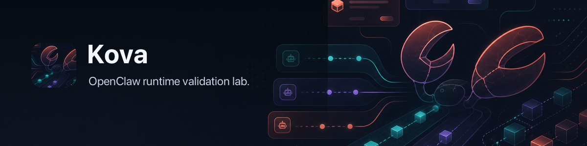

# Kova 🧪 — Make OpenClaw prove it

[](https://github.com/openclaw/Kova/actions/workflows/ci.yml)
[](https://github.com/openclaw/Kova/releases/latest)
[](https://nodejs.org/)
[](https://github.com/openclaw/Kova/actions/workflows/ci.yml)
[](LICENSE)



Kova runs release-shaped OpenClaw scenarios on real machines and records the
evidence. It is for maintainers and agents validating install, upgrade, gateway,
agent, plugin, TUI, MCP, browser, and long-running behavior before a release.

<p align="center">
  
</p>

## Install

Kova requires Node.js 22 or newer. Real scenarios use
[OCM](https://github.com/openclaw/ocm) to provision isolated OpenClaw
environments; the installer can install it at the same time:

```sh
curl -fsSL https://raw.githubusercontent.com/openclaw/Kova/main/install.sh | KOVA_INSTALL_OCM=1 bash
```

This installs Kova under `~/.kova` and links `kova` into `~/.local/bin`.

To run Kova from a source checkout instead:

```sh
git clone https://github.com/openclaw/Kova.git
cd Kova
npm ci
```

Use `node bin/kova.mjs` in place of `kova` in a source checkout.

## Quick start

Preview the smoke matrix without changing an OpenClaw environment:

```sh
kova matrix plan --profile smoke --target runtime:stable
```

The plan resolves the current scenarios, states, and evidence obligations for
the selected target in a few seconds.

## Run a real matrix

Confirm the lab is healthy, then execute the matrix against an existing OCM
runtime:

```sh
kova self-check
kova matrix run --profile smoke --target runtime:stable --execute
```

Kova uses deterministic mock model auth by default. Run `kova setup` when a
scenario needs live provider credentials.

## How Kova works

Kova evaluates a concrete product path rather than treating a successful
command as proof:

```text
surface × user state × target runtime × platform → evidence → verdict
```

Surfaces, states, scenarios, profiles, process roles, and thresholds are
declarative JSON contracts. OCM creates and controls the disposable lab;
OpenClaw remains the product under test.

### Targets

| Selector | What Kova tests |
|---|---|
| `npm:<version>` | A published OpenClaw version |
| `release:<name>` | A published release track such as `stable` or `beta` |
| `runtime:<name>` | An existing OCM runtime |
| `local-build:<path>` | A release-shaped build from an OpenClaw checkout |

Profiles turn those targets into repeatable matrices. Start with `smoke`, use
`release` for the ship gate, and use focused profiles for diagnostics, upgrades,
plugins, soak, or adversarial behavior. See the [CLI reference](docs/CLI_REFERENCE.md)
for the current commands, selectors, and profiles.

## Evidence and reports

Kova records readiness, health, command results, CPU and RSS by process role,
OpenClaw diagnostic spans, provider timing, cleanup, and artifacts. Repeated runs
produce median, p95, maximum, and variance measurements; reviewed baselines make
regressions visible separately from functional failures.

Every human-facing command renders a dashboard by default. Use `--json` for the
stable machine contract, `--plain` for compact text, or `--ascii` for
Unicode-free output. Reports can be summarized, compared, or bundled for a
fixer handoff:

```sh
kova reports
kova report <run-id>
kova report compare <baseline-run-id> <current-run-id> --json
kova report bundle <run-id> --json
```

The JSON report uses the `kova.report.v1` schema. Its fields and gate outcomes
are documented in the [report schema](docs/REPORT_SCHEMA.md).

## Safety

`run` and `matrix run` are dry-run by default; real execution requires
`--execute`. Disposable environments are removed after a run. Durable user
environments are clone sources, never mutation targets, and exhaustive matrices
also require `--allow-exhaustive`.

Use `--retain-on-failure` to keep a failed disposable lab for inspection. The
[agent workflow](docs/AGENT_USAGE.md) covers authentication, baselines,
existing-user tests, cleanup, and evidence handoff in depth.

## For agents

Agents should plan and consume reports through JSON:

```sh
kova plan --json
kova matrix plan --profile smoke --target runtime:stable --json
kova report summarize <run-id> --json
```

Repo-local `kova-operator` and `ocm-operator` skills live in `.agents/skills/`.
Load `ocm-operator` before executing scenarios that create environments, clone
state, build runtimes, upgrade installations, or inspect services.

## Documentation

- [What Kova is](docs/WHAT_IS_KOVA.md) explains the model and evidence pipeline.
- [CLI reference](docs/CLI_REFERENCE.md) lists commands, targets, profiles, and output controls.
- [Agent usage](docs/AGENT_USAGE.md) is the operational workflow for real runs.
- [Scenario hierarchy](docs/SCENARIO_HIERARCHY.md) defines ownership across runtime paths.
- [Diagnostics contract](docs/DIAGNOSTICS_CONTRACT.md) describes OpenClaw timeline evidence.
- [Report schema](docs/REPORT_SCHEMA.md) documents reports, comparisons, bundles, and gates.

## Development

```sh
npm ci
npm run check:full
npm run pack:release
```

CI runs the full check suite and release-install smoke test on macOS and Linux.

## License

[MIT](LICENSE).
